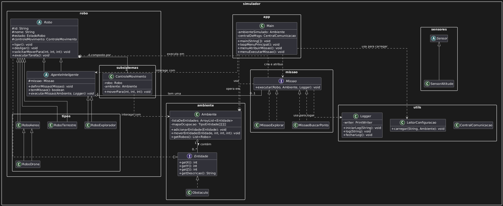

# MC322 - Laboratórios

## Informações Gerais

- **IDE usada**: IntelliJ IDEA
- **Versão do Java**: 23.0.2

---

## Sobre o repositório

Este repositório contém os códigos dos laboratórios desenvolvidos na disciplina MC322 - Programação Orientada a Objetos.
Cada laboratório propõe a implementação de conceitos como classes, herança, composição, polimorfismo e tratamento de exceções.

- `lab01-281302`: *Primeiros conceitos de classes e objetos.*
- `lab02-281302`: *Introdução a herança e sobrescrita de métodos.*
- `lab03-281302`: *Sistema de simulação de robôs e sensores.*
- `lab04-281302`: *Refinamento do simulador com interfaces, polimorfismo e tratamento de exceções.* 
- `lab05-281302`: *Modularização do projeto em pacotes, composição de robôs com subsistemas e implementação de missões autônomas com logging em arquivo.* 

---

## Como executar cada laboratório

- **lab01**: Executar `Main.java` somente. Todas as criações e verificações serão impressas na tela.

- **lab02**: Executar `Main.java` somente. Todas as criações e verificações serão impressas na tela.

- **lab03**: Executar `Main.java` e escolher as opções desejadas para testar os Robôs e Objetos implementados.

- **lab04**: Executar `Main.java` e escolher as opções desejadas no menu interativo para testar os Robôs e suas funcionalidades. O menu apresentado é no seguinte modelo:

====== MENU PRINCIPAL DO SIMULADOR ======

1. Visualizar Mapa do Ambiente
2. Listar Robôs (por tipo ou estado)
3. Interagir com um Robô Específico
4. Ativar Sensores de Todos os Robôs
5. Ver Histórico de Comunicação
0. Sair da Simulação
Sua escolha:


- **lab05**: A execução do Lab 5 é controlada por um arquivo de configuração para maior flexibilidade.
1.  **Crie um arquivo `config.txt`** na raiz do projeto (`lab05-281302/`) com a definição do ambiente, robôs, obstáculos e missões, conforme o exemplo abaixo:
    ```
    # Arquivo de configuração para o simulador
    AMBIENTE 15 15 10

    # Formato: ROBO <Tipo> <ID> <Nome> <X> <Y> [Z]
    ROBO EXPLORADOR R1 Wall-E 1 1 0
    ROBO EXPLORADOR R2 Eve 13 13 0

    # Formato: OBSTACULO <Tipo> <X> <Y> <Z>
    OBSTACULO PREDIO 8 2 0
    OBSTACULO BALAO 10 12 5

    # Formato: MISSAO <ID_Robo> <TIPO_MISSAO> [parametros...]
    MISSAO R1 BUSCARPONTO 10 10 0
    MISSAO R2 EXPLORAR 40
    ```
2.  **Execute `Main.java`**. [cite_start]O programa irá ler o `config.txt` para inicializar o cenário.
3.  [cite_start]Utilize o menu interativo para atribuir ou executar missões autônomas. A execução de uma missão irá gerar um arquivo de log (ex: `log_missao_R1.txt`) na raiz do projeto. 
    ```
    ====== MENU PRINCIPAL (LAB 5) ======
    1. Visualizar Mapa do Ambiente
    2. Listar Robôs e Missões
    3. Atribuir Missão a um Agente
    4. Executar Missão de um Agente
    5. Ver Histórico de Comunicação
    0. Sair
    ```

## Diagramas de Classes

### Diagrama de classes do laboratório 3


### Diagrama de classes do laboratório 4


### Diagrama de classes do laboratório 5




