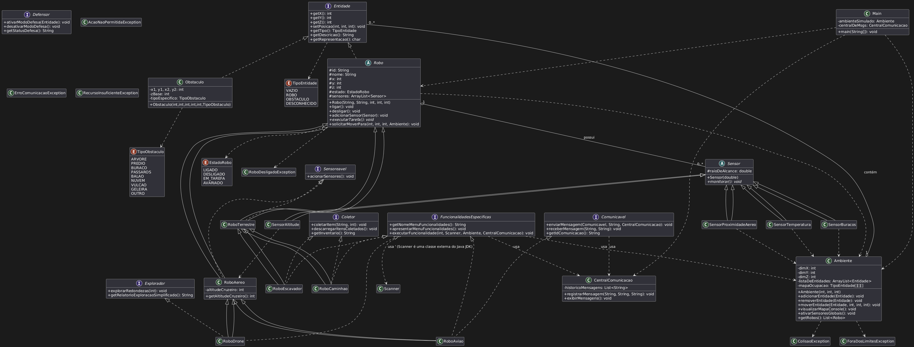

# MC322 - Laboratórios

## Informações Gerais

- **IDE usada**: IntelliJ IDEA
- **Versão do Java**: 23.0.2

---

## Sobre o repositório

Este repositório contém os códigos dos laboratórios desenvolvidos na disciplina MC322 - Programação Orientada a Objetos.  
Cada laboratório propõe a implementação de conceitos como classes, herança, composição, polimorfismo e tratamento de exceções.

- `lab01-281302`: *Primeiros conceitos de classes e objetos*
- `lab02-281302`: *Introdução a herança e sobrescrita de métodos*
- `lab03-281302`: *Sistema de simulação de robôs e sensores*
- `lab04-281302`: *Sistema de simulação de robôs e sensores*

---

## Como executar cada laboratório

- `lab01`: executar Main.java somente, todas as criações e verificações serão impressas na tela.

- `lab02`: executar Main.java somente, todas as criações e verificações serão impressas na tela.

- `lab03`: executar Main.java e escolher as opções desejadas para testar os Robôs e Objetos implementados.

- `lab03`: executar Main.java e escolher as opções desejadas para testar os Robôs e Objetos implementados, o menu apresentado é no seguinte modelo:

====== MENU PRINCIPAL DO SIMULADOR ======
1. Visualizar Mapa do Ambiente
2. Listar Robôs (por tipo ou estado)
3. Interagir com um Robô Específico
4. Ativar Sensores de Todos os Robôs
5. Ver Histórico de Comunicação
0. Sair da Simulação
Sua escolha: 

## Diagrama de classes do laboratório 3

## Diagrama de classes do laboratório 4

